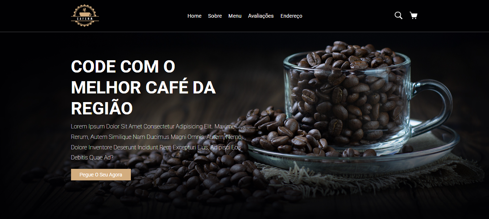

☕ Landing Page - Cafeteria
Este é um projeto de uma Landing Page para uma Cafeteria, desenvolvido com foco em layout e apresentação visual. O objetivo foi criar uma página atrativa, moderna e funcional, utilizando tecnologias básicas da web.

## 🔗 Acesse o projeto | Live Preview

[👉 Clique aqui para acessar | Click here to view](https://cafe-cafena.netlify.app/)

🚀 Tecnologias Utilizadas
HTML5
CSS3

## 📸 Imagem do projeto | Project Screenshot

(https://github.com/brotherson10/Landing-Page-Cafeteria/blob/main/page-cafeteria.png?raw=true)

🎯 Funcionalidades
Página inicial com informações sobre a cafeteria.

Seções como: Sobre nós, Cardápio, Contato e Localização.

Layout totalmente responsivo, adaptado para dispositivos móveis, tablets e desktops.

Botões e links para interação dos usuários.

📫 Contato | Contact
LinkedIn
https://www.linkedin.com/in/brotherson/
